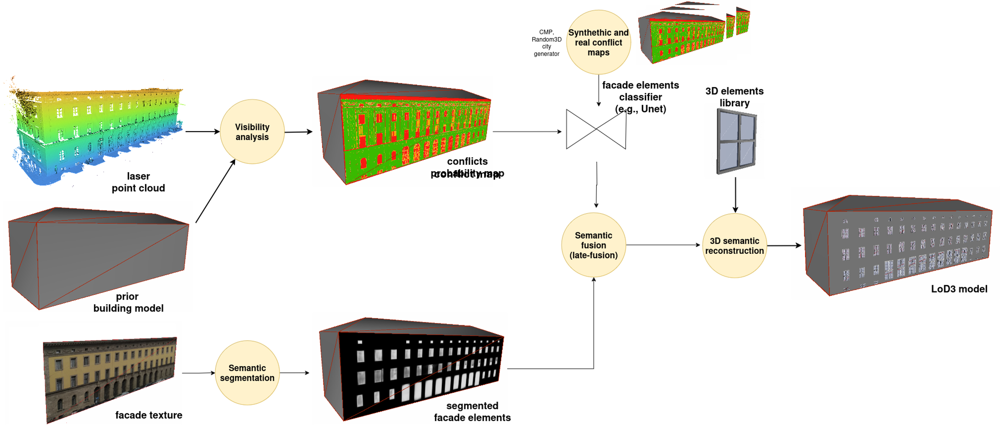
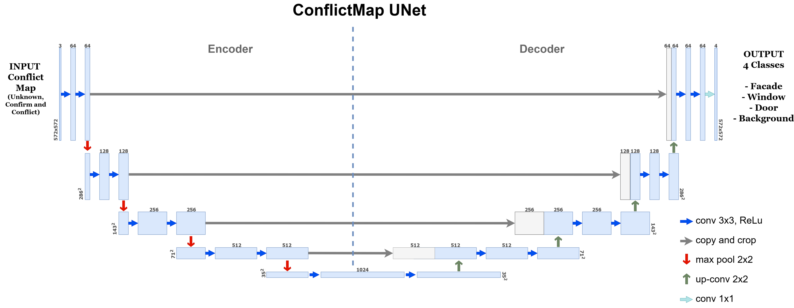

# CM2LoD3: Reconstructing LoD3 Building Models Using Semantic Conflict Maps

This repository contains the complete implementation for CM2LoD3: Reconstructing LoD3 Building Models Using Semantic Conflict Maps enabling automatic LoD3 (Level of Detail 3) building model reconstruction using terrestrial laser scanner data.

## Collaborators
- Franz Hanke
- Antonia Bieringer

## Supervisor
- Dr. Olaf Wysocki (Photogrammetry & Remote Sensing, TUM)

The published paper can be found under `!Arxiv link!`.

## Project Overview

This project develops a complete processing chain for automatic LoD3 reconstruction, implementing a novel multimodal approach that combines conflict map analysis with image-based segmentation and semantic fusion.



## Architecture & Methodology

Our approach builds upon the Scan2LoD3 method, implementing a three-branch processing pipeline:

1. **Conflict Map Processing** - Using terrestrial laser scanner data to generate probabilistic conflict maps
2. **Image-based Segmentation** - Mask R-CNN for facade element detection  
3. **Semantic Fusion** - Combination of multimodal evidence



## Implementation Components

### Part 1: U-Net for Conflict Map Processing
**File:** `UNetTraining.ipynb`

- **Input:** 3-channel conflict maps (572×572) with RGB encoding:
  - Green (0,255,0): Confirming observations
  - Blue (0,0,255): Unknown regions  
  - Red (255,0,0): Conflict regions
- **Output:** 4-class semantic segmentation (Facade, Window, Door, Unknown)
- **Architecture:** Modified U-Net with size-matching upconvolution
- **Training:** Early stopping, model checkpointing, comprehensive metrics (IoU, Dice)

**Pre-trained Models:** `\Scan2LOD_DATA\Models\Facade_model_b14_e50_CMPGEN*.pth`
- Multiple variants trained on different data combinations (CMP, Generator, Real data)

### Part 2: Mask R-CNN for Image Segmentation
**File:** `MaskRCNNTraining.ipynb`

- **Input:** RGB facade images (572×572)
- **Output:** Instance masks for windows and doors
- **Architecture:** Mask-RCNN
- **Training:** Separate models for windows and doors to optimize performance

**Pre-trained Models:** `\Scan2LOD_DATA\Models\MASK_RCNN_*.pth`
- `MASK_RCNN_onlyWindows.pth`: Specialized window detection
- `MASK_RCNN_doors.pth`: Specialized door detection

### Part 3: Semantic Fusion & Probabilistic Integration
**File:** `Scan2LoD_Predictor.ipynb`

Implements the core semantic network fusion:

```python
def combine_predictions_linear(unet_probs, window_probs, door_probs):
    # Weighted combination with learned hyperparameters
    combined_probs[1] = window_alpha * unet_probs[1] + window_beta * window_probs
    combined_probs[2] = door_alpha * unet_probs[2] + door_beta * door_probs
    # Probability normalization to ensure valid probability distribution
    return normalized_combined_probs
```

### Part 4: 3D Reconstruction & LoD3 Model Generation
**File:** `Scan2LOD_Predictor_WallMatch.ipynb`

**Key Features:**
- **Contour Detection:** Automated extraction of opening boundaries from segmentation masks
- **3D Coordinate Mapping:** Bilinear interpolation from 2D predictions to 3D wall coordinates
- **Wall Corner Extraction:** Geometric analysis to determine facade orientation and boundaries
- **CityGML Generation:** Standards-compliant LoD3 output with proper semantic structure

**3D Reconstruction Pipeline:**
1. Extract wall surfaces from input LoD2 CityGML
2. Map 2D prediction coordinates to 3D wall space using bilinear interpolation
3. Generate opening geometries with proper positioning
4. Create interior rings in wall polygons for openings
5. Export semantic LoD3 CityGML with facade elements

```python
def create_prediction_to_wall_mapping(wall_corners, pred_shape):
    """Create transformation from 2D prediction space to 3D wall coordinates"""
    def map_pred_to_wall(x, y):
        u = x / pred_width
        v = 1.0 - (y / pred_height)  
        # Bilinear interpolation in 3D space
        bottom = (1 - u) * wall_corners["bottom_left"] + u * wall_corners["bottom_right"]
        top = (1 - u) * wall_corners["top_left"] + u * wall_corners["top_right"]
        point_3d = (1 - v) * bottom + v * top
        return point_3d
    return map_pred_to_wall
```

### Part 5: Alternative Approaches & Baselines
**File:** `Mask2Former Facade Segmentation.txt`

Implementation of Mask2Former as a baseline comparison method for transformer-based semantic segmentation.

## Evaluation & Metrics

The system provides comprehensive evaluation across multiple dimensions:

### Semantic Segmentation Metrics
- **Per-class IoU (Intersection over Union)**
- **Dice Coefficient** for shape similarity assessment
- **Precision/Recall** for detection accuracy
- **Confusion Matrix Analysis** for error pattern identification

### 3D Reconstruction Quality
- **Geometric Accuracy:** RMS deviation from ground truth LoD3 models
- **Watertightness Validation:** Ensuring manifold geometry
- **Opening Detection Rate:** Percentage of correctly identified facade elements
- **False Alarm Rate:** Quality control for spurious detections

### Evaluation Results
Based on TUM campus dataset evaluation:
- **Detection Rate:** 91% for all openings, 98% for laser-measured openings
- **IoU Performance:** Up to 76.2% median IoU for opening segmentation  
- **3D Accuracy:** 52% improvement over standard Poisson reconstruction
- **Model Completeness:** Handles occlusions (blinds, vegetation) effectively
- **Overall Quality:** Visible enchancements in contour detection

## Data Requirements

### Input Data
- **Conflict Maps:** RGB images (572×572) from ray-casting analysis
- **Facade Images:** RGB photographs of building facades
- **LoD2 CityGML:** Base geometric building models
- **Ground Truth:** Manual annotations for training/validation

### Supported Formats
- **Images:** PNG, JPG for facade imagery
- **3D Models:** CityGML 2.0 standard for geometric input/output
- **Point Clouds:** Support for mobile laser scanning data

## Installation & Usage

### Prerequisites
```bash
pip install torch torchvision transformers
pip install opencv-python matplotlib tqdm
pip install lxml numpy scipy scikit-learn
pip install jupyter notebook
```

### Running the Pipeline

1. **Prepare conflict maps and facade images** in the required directory structure
2. **Train or load models:**
   ```python
   # Load pre-trained U-Net
   unet_model = load_unet_model('Facade_model_b14_e50_CMPGENREAL_nS.pth')
   
   # Load Mask R-CNN models  
   maskrcnn_windows = load_maskrcnn_model('MASK_RCNN_onlyWindows.pth')
   maskrcnn_doors = load_maskrcnn_model('MASK_RCNN_doors.pth')
   ```

3. **Run semantic fusion:**
   ```python
   combined_probs = combine_predictions_linear(unet_probs, window_probs, door_probs)
   final_prediction = np.argmax(combined_probs, axis=0)
   ```

4. **Generate LoD3 model:**
   ```python
   output_gml = generate_lod25_from_predictions(input_gml_path, predictions)
   ```

## Technical Innovation

### Probabilistic Fusion Framework
Our Semantic network approach enables:
- **Uncertainty Quantification:** Each prediction includes confidence estimates
- **Multimodal Integration:** Principled combination of geometric and visual evidence  
- **Robust Reconstruction:** Graceful handling of sensor limitations and occlusions

### Geometric Accuracy
- **Precise 3D Positioning:** Sub-meter accuracy in opening placement
- **Watertight Geometry:** Maintains topological consistency required for LoD3
- **Semantic Preservation:** Full integration with CityGML semantic structure

## Applications

This LoD3 reconstruction pipeline enables:
- **Urban Digital Twins** for smart city applications
- **Autonomous Driving Simulation** with detailed building facades
- **Energy Analysis** with accurate window/door modeling  
- **Flood Simulation** requiring precise building geometries
- **Solar Potential Assessment** on detailed facade models

## Acknowledgments

This work builds upon the Scan2LoD3 method developed by Wysocki et al. (CVPRW 2023) and was conducted within the framework of the Leonhard Obermeyer Center at the Technical University of Munich (TUM). The project was supported by the Bavarian State Ministry for Economic Affairs through the MoFa3D project.

## Repository Structure
```
├── PerformanceEval_IOU/
│   ├── Evaluations/                # Current Model to be evaluated
│   ├── Predictions/                # Input conflict maps that are to be evaluated
│   └── Results/                    # Evaluation results for the models
├── Scan2LOD_DATA/
│   ├── Models/                     # Pre-trained model weights (pth)
│   ├── Inputs/                     # Input conflict maps and images
│   └── Outputs/                    # Generated LoD3 models
├── UNetTraining.ipynb              # U-Net training pipeline
├── MaskRCNNTraining.ipynb          # Mask R-CNN training pipeline  
├── Scan2LoD_Predictor.ipynb        # Semantic fusion implementation
└── images/                         # Documentation figures
```

For access to pre-trained models and datasets, please contact the authors directly.
