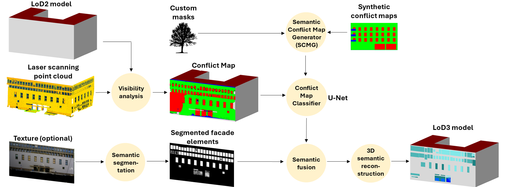

# 1. Reconstructing LoD3 Building Models Using Terrestrial Laser Scanner

This Gitlab repo is the code documentation of the Photogrammetry Project 2025. 
Collaborators:
- Franz Hanke
- Antonia Bieringer

Supervisor:
- Dr. Olaf Wysocki

The report for this project can be found under \report\report.pdf.

This projects is developing a processing chain for enabling automatic LoD3 reconstructing. The workflow of the project is as follows:

**Part 1: U-Net**
The U-Net was trained within its own file. The code can be found under UNetTraining.ipynb. The pre-trained weights can be found under \Scan2LOD_DATA\Models\Facade_model_b14_e50_CMPGEN*.pth. The detailed description of the 4 different models are described in the report.
The structure looks as as follows:

**Part 2: Mask R-CNN**
The Mask R-CNN was also trained within its own file. The code was developed by Wysocki (2023). The adjusted code for this project can be found under MaskRCNNTraining.ipynb. The pre-trained weights can be found under \Scan2LOD_DATA\Models\Mask_RCNN_*.pth Please get in contact so we can share them directly. The detailed description of the 3 different models are described in the report. 

**Part 3: Final Code with Semantic Fusion of Both Networks**
The combination of both pre-trained networks is done in the file Scan2LoD_Predictor.ipynb. Here, the semantic fusion is implemented.